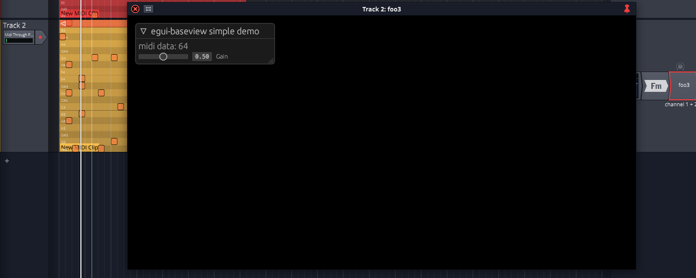

# egui_baseview_test_vst2

* tested on linux
* slider adjusts gain
* data from most recent midi note is displayed in GUI
* midi events are output one octive higher than the input
* run gui without DAW: `cargo run --bin standalone`

